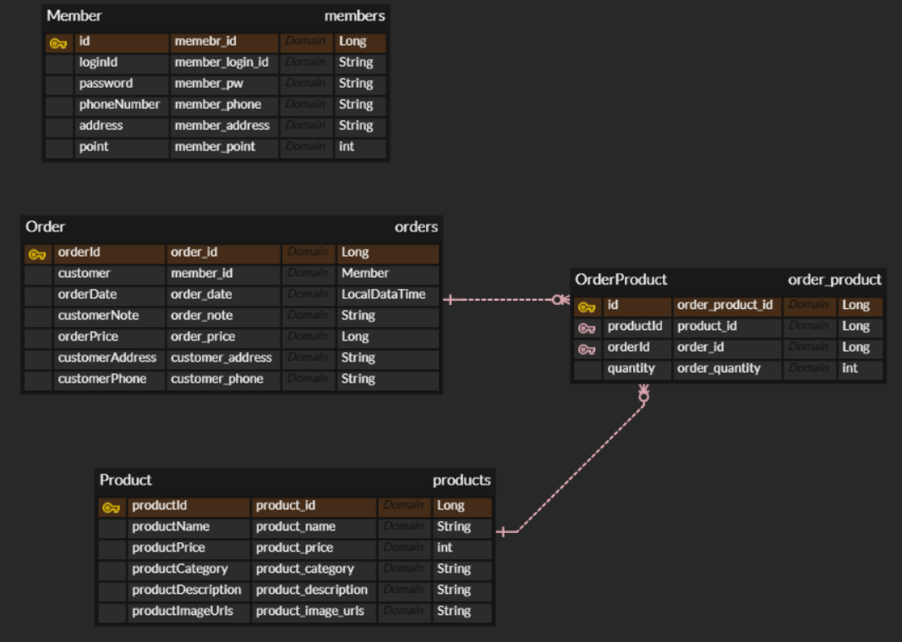
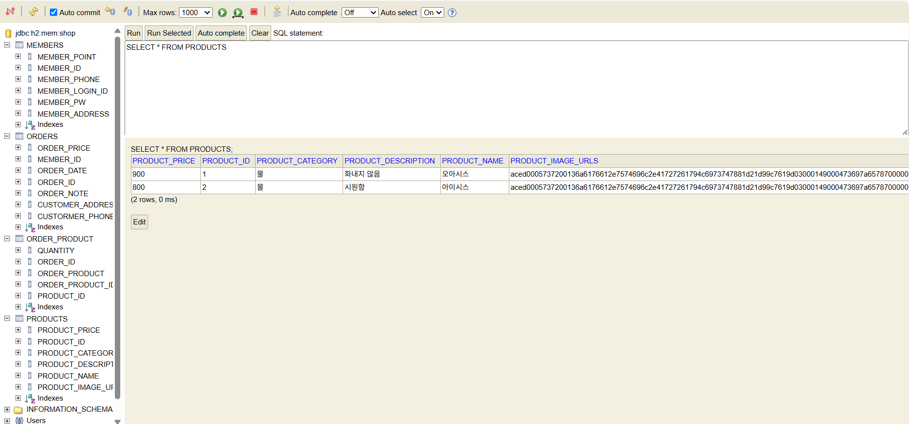

## ERD(Entity-Relationship Diagram)
* ERD = 데이터 청사진
    * ENtity(개체): 데이터를 가진 대상
    * Relation(관계) : 개체 사이의 연관성
    * ER Model : 개체-관계 중심의 모델링 기법
    * ER Model을 시각적으로 표현 -> 

## DB 설계
* 용어
    1. 엔티티(Entity) : 관리해야할 데이터의 주체
    2. 속성(Attribute) : 각 엔티티가 가지는 구체적 정보
    3. 기본 키(Primary key) : 고유하게 식별 하는 데 사용되는 하나 이상의 컬럼(필드)  ex) Memberid
    4. 외래 키(Forein key) : 다른 테이블의 PK를 참조(저장)하는 속성컬럼)
    5. 관계(relation) : 개체 사이의 연관성, 업무 규칙
        * 테이블 또는 외래키로 구현
        * 일대다(1 : N) -> 외래키, 다대다(N : M) -> 테이블, 다대일(N : 1), 일대일(1 : 1)
* ERD Cloud 활용
    * 식별관계 vs. 비식별 관계
        * 식별 : 강한 연관 관계
            * 관계 대상의 PK를 자신의 PK로도 사용
        * 비식별(일반적) : 느슨한 연관관계
            * 관계 대상의 PK를 자신의 FK로만 사용;
    

## 실습(JPA)
* 엔티티 구현
  1. 엔티티 클래스
    * @Entity, @Id 어노테이션이 필요
    * Id값을 자동 생성: @GeneratedValue 사용
    * @Column으로 컬럼 명, 컬럼 타임 등을 지정
  2. 외래키(FK)
    * 엔티티 객체를 필드로 넣은 후 
      * @JoinColumn : FK 컬럼 정보를 명시(name 등)
      * @ManyToOne : 연관관계
    * @ManyToOne 에서 fetch 속성은 LAZY로 지정(필요할 때 불러옴)
    * '엔티티 객체'를 필드로 지정 -> ORM(JPA)가 외래키로 알아서 처리
  3. 엔티티 생성자
     * 보통 id 필드를 제외하고 생성
     * JPA가 엔티티를 사용하려면 인자 없는 생성자가 필요
     -> @NoArgsConstructor 어노테이션으로 만들 수 있음
     * access 속성을 통해 접근 제한자를 protected로 설정
     -> JPA는 사용 가능, 외부사용 차단
     * 추가로 엔티티 객체에 @Getter를 추가 -> 모든 필드에 getter를 생성

## ERD 사진

## H2 테이블 스크린샷

## postman 테스트 결과

